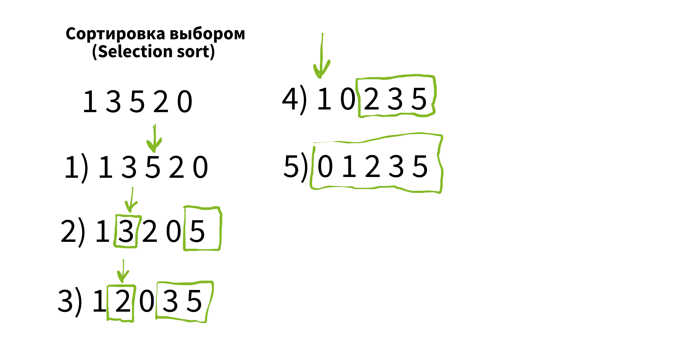
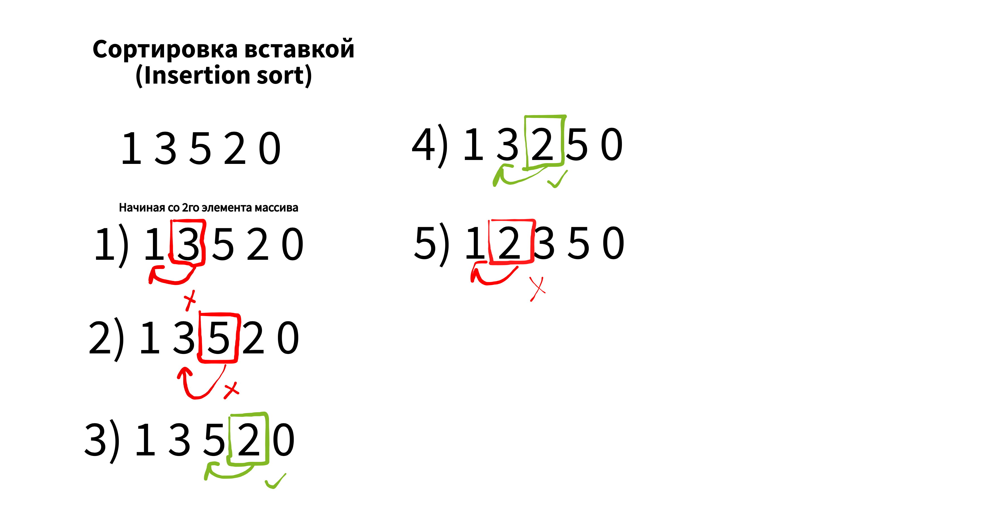

# Sorting and algorithms

## Types of sorting and algorithms

[Swagger](http://localhost:8080/api/doc)

## Сортировки.  
Сложность O(n^2) = ((n*(n-1))/2)
- [x] Сортировка выборкой (Selection sort) 
- [x] Пузырьковая сортировка (Bubble sort)
- [x] Сортировка вставкой (Insertion sort)
## Алгоритмы
- [ ] 1

---
##*Описание сортировок*
***Сортировка выборкой (Selection sort)***  

***Пузырьковая сортировка (Bubble sort)***  

***Сортировка вставкой (Insertion sort)***  

***Пузырьковая сортировка (Bubble sort)***  

***Пузырьковая сортировка (Bubble sort)***  

***Пузырьковая сортировка (Bubble sort)***  

***Пузырьковая сортировка (Bubble sort)***  

---

## *ToDo*  
* Sorting
- [x] Сортировка выборкой (Selection sort). Сложность O(n^2)
* Algorithms:
- [ ] 