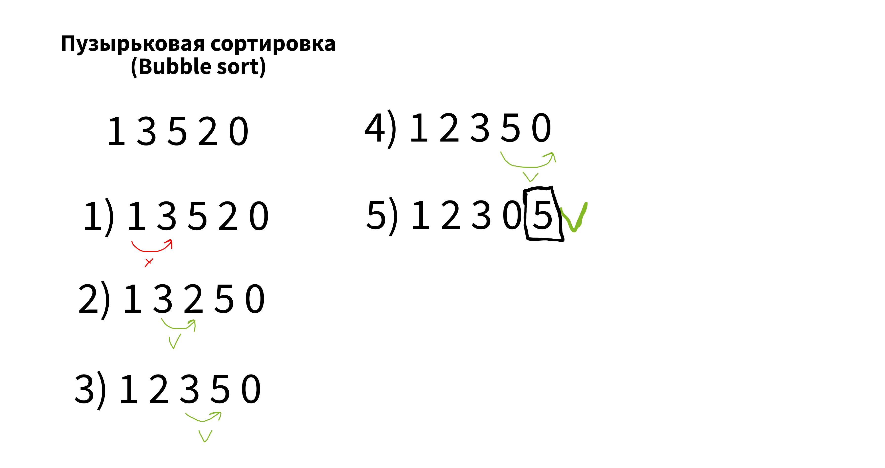

# Sorting and algorithms

## Types of sorting and algorithms

[Swagger](http://localhost:8080/api/doc)

## Сортировки.  
Сложность O(n^2) = ((n*(n-1))/2)
- [x] Сортировка выборкой (Selection sort) 
- [x] Пузырьковая сортировка (Bubble sort)
- [x] Сортировка вставкой (Insertion sort)
- [x] Сортировка подсчётом (Counting sort)  
## Алгоритмы
- [ ] 1

---
##*Описание сортировок*
***Сортировка выборкой (Selection sort)***  
Находим максимум(/минимум) и ставим в конец(/начало).  
Уменьшая перебор на единицу.

***Пузырьковая сортировка (Bubble sort)***  
Сравниваем 0 и 1 элемент массива.  
Меняем местами - Максимумставим в конец.  
В конце уменьшаем массив на единицу.

***Сортировка вставкой (Insertion sort)***  
Начинаем со 2го элемента массива.  
Если он меньше - меняем местами до тех пор пока слева не будут меньше него.

***Сортировка подсчётом (Counting sort))***  
Сложность O(n+m).  
Узнаем максимальную и минимальную длинну массива.  
Строим новый массив.  
Его размер должен равняться разнице между максимальным и минимальным значением.  
В поля (идекс минус минимум) записываем число повторений. 

***Пузырьковая сортировка (Bubble sort)***  

***Пузырьковая сортировка (Bubble sort)***  

***Пузырьковая сортировка (Bubble sort)***  

---

## *ToDo*  
* Sorting
- [x] Сортировка выборкой (Selection sort). Сложность O(n^2)
* Algorithms:
- [ ] 